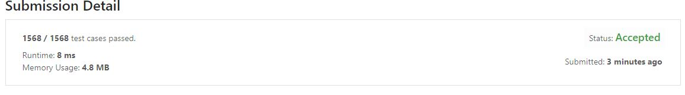

今天寫的題目跟昨天一樣  
不過我們來改為用Golang 寫吧!

題目為  
```

You are given two non-empty linked lists representing two non-negative integers. The digits are stored in reverse order, and each of their nodes contains a single digit. Add the two numbers and return the sum as a linked list.

You may assume the two numbers do not contain any leading zero, except the number 0 itself.
```

### Example 1 :


```
Input: l1 = [2,4,3], l2 = [5,6,4]
Output: [7,0,8]
Explanation: 342 + 465 = 807.
```

### Example 2 :
```
Input: l1 = [0], l2 = [0]
Output: [0]
```

### Example 3 :
```
Input: l1 = [9,9,9,9,9,9,9], l2 = [9,9,9,9]
Output: [8,9,9,9,0,0,0,1]
```

### 解法
---
1. 實際解法
    ``` golang
    /**
    * Definition for singly-linked list.
    * type ListNode struct {
    *     Val int
    *     Next *ListNode
    * }
    */
    func addTwoNumbers(l1 *ListNode, l2 *ListNode) *ListNode {
    
        
        return Calculation(l1,l2,0)
        
    }

    func Calculation(l1 *ListNode, l2 *ListNode, carry int) *ListNode {
        if (l1==nil && l2==nil && carry==0 ) {
            return nil;
        }
        
        if l1 == nil {
            l1 = &ListNode { Val:0 , Next : nil }
        }
        
        if l2 == nil {
            l2 = &ListNode { Val:0 , Next : nil }
        }
        
        val := int(l1.Val) + int(l2.Val) + carry
        carry = val/10
        return &ListNode { Val: val%10 , Next : Calculation(l1.Next ,l2.Next ,carry) }
        
    }
    ```

1. 執行效能
    

碎碎念
===
沒想到用 `Golang` 寫出來的效能遠遠超過 `C#`，真的是太出乎意料了，明天再來實驗看看PHP吧。

